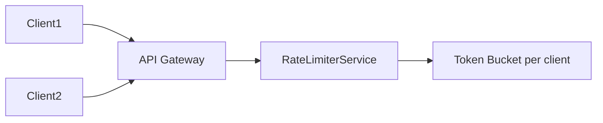
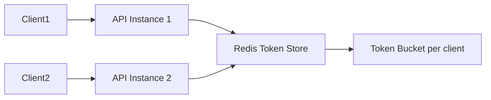

# Rate Limiter Architecture

### Single-Instance Token Bucket

### Distributed Token Bucket

### Components
1. **API Gateway**: Entry point for all requests. Routes to backend service.
2. **RateLimiterService**: Core logic that decides if a request is allowed.
3. **TokenBucket**: Stores tokens per client, refills periodically.
4. **Redis (Distributed)**: Shared state across multiple API instances.