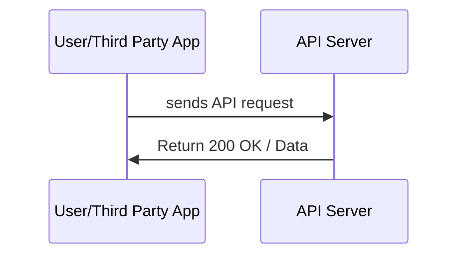
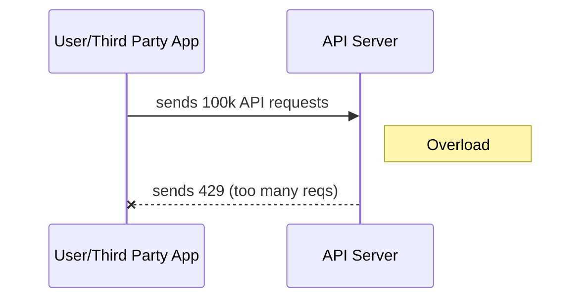
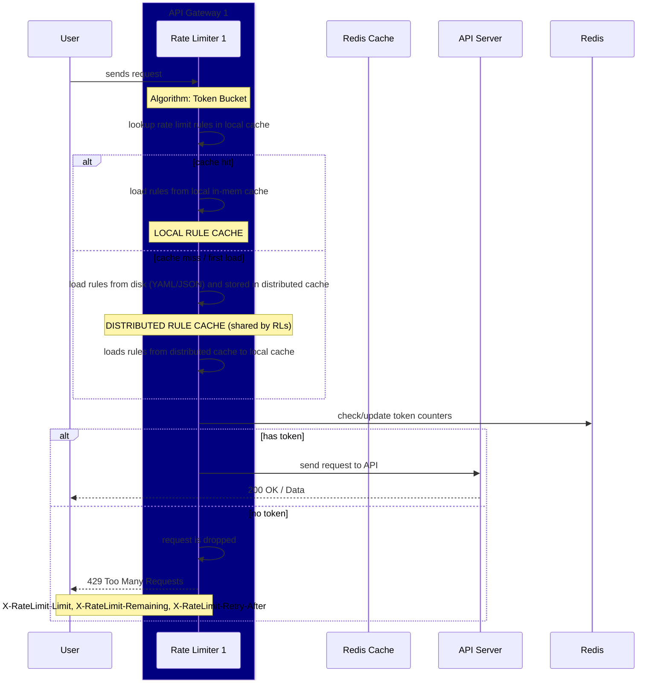

# Rate Limiter System Overview

**Goal:** Protect APIs from overuse while allowing bursts and fair usage across multiple clients.

**Key Decisions:**
- Token Bucket algorithm
- Thread-safe in-memory implementation
- Optional distributed deployment with Redis

**Requirements:**
- Max 100 requests/sec per client
- Handle concurrent requests safely

### Scenario 1: No Rate Limiter, Normal Load

### Scenario 2: No Rate Limiter, Accidental Overload / Malicious Attacks (DoS)

### Scenario 3: Rate Limiter, Accidental Overload / Malicious Attacks (DoS)

- X-Ratelimit-Limit: Indicates the maximum number of calls the client can make per time window.
- X-Ratelimit-Remaining: Shows the remaining number of allowed requests within the current window.
- X-Ratelimit-Retry-After: Specifies the number of seconds to wait until the client can make another request without being throttled.